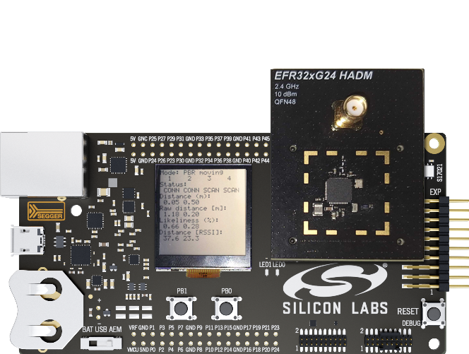

# SoC - CS Initiator

The Bluetooth SoC-CS Initiator is a project that can be used to test the Channel Sounding (CS) feature. In the provided CS setup, the application establishes connection to a reflector (Running on the host or SoC), measures in the phase based ranging (PBR) or round trip time (RTT) CS measurement modes and estimates the distance. The reflector data is obtained using the Ranging Service (RAS). The RAS Real-time mode enabled real-time data reception from the RAS Server. In on-demand mode the RAS client included in the initiator will ask for the ranging data after the data reception is finished. Moving object tracking algorithm mode and stationary object tracking algorithm mode are also supported for the measurement process. In moving object tracking mode distance will be calculated for every CS procedure while in stationary object tracking mode the calculation requires multiple CS procedures data. Moving object tracking has two different modes. The real-time basic mode is using medium filtering, medium response and medium CPU cost. The real-time fast mode is using low filtering, low CPU and RAM cost and provides basic accuracy. In stationary object tracking mode during measurement the percentage of the progress is displayed on the LCD (if the device has LCD) and logged to the console. Once all required CS procedure data is received for the distance measurement, the estimated result will arrive and it will be displayed on the LCD (if the device has LCD) and logged to the console. In order to select different algorithm modes (Moving object tracking/Stationary object tracking) the push button can be pressed during device RESET. The push button BTN1 will change the object tracking mode to Stationary object tracking. Default values can be found and modified in the component configuration file (config/cs_initiator_config.h).
If the configuration is changed to create less than 4 initiator instances, SL_BT_CONFIG_BUFFER_SIZE can be reduced.

## Usage
- Build and flash the sample application.

- The default object tracking mode is Moving Object tracking - fast. Pressing BTN1 while resetting the device selects Stationary Object tracking algorithm mode.

- After startup the CS initiator will scan for a device running the "CS RFLCT" sample application.

- When found, the initiator will establish connection to the CS reflector device and will start the distance measurement process. By default the CS initiator can create 4 connections.

- The initiator will calculate the distance, display it on the LCD (if the device has LCD) and also send them via UART. Note: in case of stationary object tracking mode multiple CS procedure data will be required. Until the distance measurement is in progress the progress percentage will be displayed on the LCD (if the device has LCD) and logged to the console.

## Resource optimization
- Flash usage can be reduced by
  - removing "Bluetooth controller anchor selection" component if no multiple reflector connection is required,
  - turning off "Logging"-"Initiator component" feature in "CS Initiator" component, CS_INITIATOR_UART_LOG in application config (app_config.h) or application logging in "Application"- "Utility" -"Log" component configuration.
- RAM usage can be reduced by
  - decreasing the "Maximum initiator connections" in "CS Initiator" component configuration to the required amount,
  - decreasing "Maximum ranging data size" in "CS Initiator" component configuration. Note that "Maximum ranging data size" should be enough to store Ranging Data in format defined in RAS specification,
  - reducing "Buffer memory size for Bluetooth stack" in "Bluetooth Core" component configuration if the "Maximum initiator connections" is changed to create less than 4 initiator instances.

### Calculating the size of "Maximum ranging data size"
The optimal value of "Maximum ranging data size" is dependent on several configuration values, and can be calculated by the following equation:

ranging_max_size = 4 + (subevents * 8) + (mode0_steps * mode0_size) + channels * ( ( 1 + ( antenna_paths + 1 ) * 4) + 1 )

where
- subevents value is constant 1 since one subevent per procedure is supported,
- mode0_size is
  - 4 for Reflector and
  - 6 for Initiator,
- mode0_steps value is the configuration "Mode 0 steps",
- channels value means the number of channels from the channel mask that can be derived from the "Channel map preset" settings:
  - "High"   - 72 (default),
  - "Medium" - 37,
  - "Low"    - 20,
  - "Custom" - Number of 1s in channel mask,
- antenna_paths value is controlled by the "Antenna configuration", and limited by number of antennas presented on each board (capabilities). Maximum can be calculated using the product of used Initiator and Reflector antennae. The default maximum value for antenna_paths is 4.

These settings were selected by assuming that the controller creates only one subevent per procedure, and the measuring mode is PBR. In RTT mode there are far less data is created.

If you use submode, you should add the following to the sum:

(1 + mode1_size) * channels / main_mode_steps

where
- mode1_size is 6
- main_mode_steps is the value of min_main_mode_steps ranging from to 2. This can be changed in cs_initiator_client.h.

The default is calculated by using the constants and settings above using the worst case scenario, which gives 1866 bytes.
RAM consumption can be reduced by changing the affected settings and reducing "Procedure maximum length" accordingly.

## Known issues and limitations

* In case RTT mode used with stationary object tracking algorithm mode the behavior will be the same as RTT with moving object tracking mode.
* CS main mode RTT and CS algo mode real-time fast combination is not supported.
* CS algo mode real-time fast and synchronized procedure execution (max procedure count == 1) combination is not supported.

## Troubleshooting

This sample application does need a bootloader (Bootloader - SoC Bluetooth AppLoader OTA DFU).

## Resources

[Bluetooth Documentation](https://docs.silabs.com/bluetooth/latest/)

[UG103.14: Bluetooth LE Fundamentals](https://www.silabs.com/documents/public/user-guides/ug103-14-fundamentals-ble.pdf)

[QSG169: Bluetooth SDK v3.x Quick Start Guide](https://www.silabs.com/documents/public/quick-start-guides/qsg169-bluetooth-sdk-v3x-quick-start-guide.pdf)

[UG434: Silicon Labs Bluetooth ® C Application Developer's Guide for SDK v3.x](https://www.silabs.com/documents/public/user-guides/ug434-bluetooth-c-soc-dev-guide-sdk-v3x.pdf)

[Bluetooth Training](https://www.silabs.com/support/training/bluetooth)

[Ranging Service](https://www.bluetooth.com/specifications/specs/ranging-service-1-0/)